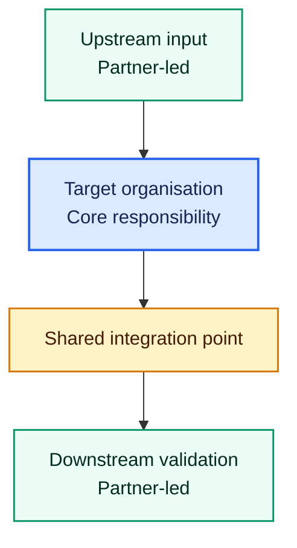
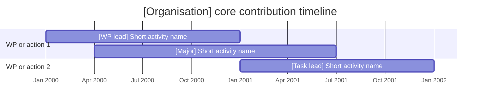

# Report template and writing standard

Adapt the headings to the proposal. Keep the report self-contained.

## Required report structure

### Title

Use:

`# [Organisation]'s Role and Journey Through [Project]`

Add a short source note:

- source document or documents;
- target organisation and confirmed aliases;
- scope used for “major contribution”;
- important extraction limitations, if any.

### Executive summary

Open with the main finding. Explain the organisation's overall role in two or three short paragraphs.

Include one plain-language journey sentence, for example:

> Define the shared rules, build the organisation's component, connect it to the wider project, and check the handover.

Use the organisation's actual journey. Do not reuse this wording when it does not fit.

If reliable effort data exists, state where the organisation's effort is concentrated. Explain that effort supports the interpretation but does not define ownership.

### Terms used

Define only terms needed to understand the report. Use one short sentence per term.

Do not copy a glossary from the proposal. Avoid defining common words.

### Core WP and task assessment

Create one section per core WP, action or equivalent unit.

Start each section with:

- the formal WP lead;
- the target organisation's overall role;
- a one-sentence boundary when another partner owns most of the WP.

For each core task, use this pattern:

#### [Task ID] - [Short task title]

**Formal lead:** [Organisation]

**What [target] is expected to do**

- [Concrete duty]
- [Concrete output]

**Responsibility boundary**

- [Target's responsibility]
- [Other partner's responsibility]
- [Important responsibility the target does not own]

**Related project concept:** [Element, objective, component, result, KER or LIFE action]

**Evidence:** [Task, deliverable, table, section or reliable page]

End each WP section with a short statement of the practical result.

### Journey through the project

Explain the journey as numbered steps. Use dependency order.

Each step should answer:

- What does the organisation receive?
- What does it add?
- Who receives the result next?

Keep each step to one or two short paragraphs.

### Mermaid journey diagram

Use this shape as a guide, not a fixed design:

Replace every placeholder. Add a short legend in prose.

### Mermaid Gantt

Introduce the chart with:

> The dates below are illustrative. January 2000 represents project month M1; the chart shows relative project timing, not actual calendar commitments.

Use this structure:

Replace every placeholder. Keep task labels short. Use the conversion rules in `analysis-method.md`.

Below the chart, list core activities omitted because their timing is missing or unclear.

### Responsibility boundaries at a glance

Use a compact table:

| Area | The organisation is responsible for | The organisation is not responsible for |
|---|---|---|
| [Area] | [Precise responsibility] | [Neighbouring partner responsibility] |

Do not repeat the full WP analysis. Focus on boundaries that a reader could easily misunderstand.

### Smaller roles

List supporting-boundary roles briefly. Name the formal lead and explain why the role is smaller.

State once that routine all-partner duties were excluded from the core assessment.

### Final assessment

End with two short lists:

**The organisation is best described as:**

- [Role supported by evidence]

**The organisation should not be described as:**

- [Likely overstatement]

Close with the most important partner boundary.

### Evidence limitations

Include this section only when needed. State:

- what is missing or inconsistent;
- which claims are affected;
- whether the interpretation is still reliable.

Do not bury an important source conflict in a footnote.

## Clarity rules

The report must be understandable without opening the proposal.

### Sentence level

- Put one main idea in each sentence.
- Split sentences with more than two distinct claims.
- Prefer active voice: “Partner A builds the engine.”
- Name the actor. Avoid “it will be implemented” when the proposal names who implements it.
- Prefer direct verbs: use, build, define, test, check, lead, provide, connect.
- Remove filler such as “in order to,” “with regard to,” and “it should be noted that.”
- Avoid noun-heavy phrases. Rewrite “implementation of interoperability validation activities” as “test whether the systems work together.”

### Term level

- Define an acronym the first time it appears.
- Explain project-specific terms in a short phrase.
- Keep exact task, deliverable and standard names only when they identify evidence.
- Do not stack unexplained standards or acronyms in one sentence.
- Use a familiar plain-language term after giving the exact formal name once.

### Paragraph and section level

- Lead each section with its conclusion.
- Keep paragraphs short, normally two to four sentences.
- Use bullets when listing three or more duties.
- Use a table when the same comparison repeats across tasks.
- Do not repeat the same boundary in the summary, task analysis and final assessment unless it is central to avoiding a serious misunderstanding.
- Keep caveats only when they affect ownership, confidence, timing or interpretation.

### Paraphrasing proposal text

Proposal prose is often dense. Extract the actor, action, output and handover, then rewrite them.

Dense:

> The beneficiary will contribute to the operationalisation of the integrated framework through the provision of interoperability-related inputs.

Clear:

> The beneficiary defines the interoperability rules used by the integrated framework.

Do not strengthen the verb beyond the evidence. If the proposal only says “contribute,” explain the stated contribution without changing it to “lead” or “own.”

## Final clarity review

Read the report once for evidence and once for readability.

Check every section:

- Is the main point in the first sentence?
- Is it clear who performs each action?
- Is every acronym explained?
- Can a non-specialist understand the responsibility boundary?
- Does any sentence carry too many ideas?
- Does any paragraph repeat proposal language instead of explaining it?
- Are Mermaid labels short enough to scan?
- Does the Gantt state that its dates are illustrative?

Rewrite any passage that fails one of these checks. Preserve the underlying evidence while simplifying the language.
